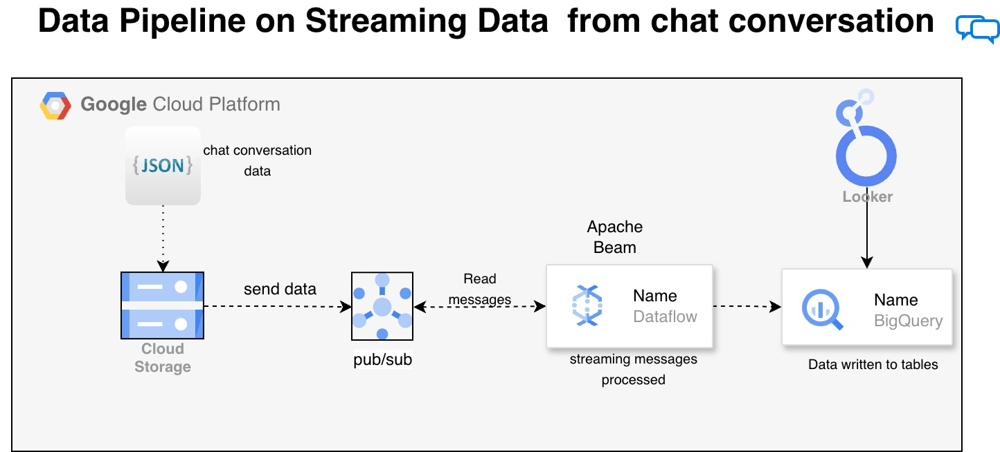

# Building a Simple Data Pipeline for Streaming Chat Conversations on GCP using terraform

This repo is a practical, end-to-end example of a **streaming** pipeline on Google Cloud. It ingests chat-style JSON events, publishes them to **Pub/Sub**, transforms them in **Apache Beam** running on **Dataflow**, and stores curated records in **BigQuery** for analytics (and optional **Looker** dashboards).

If you want the original walkthrough that inspired this repo, see the video: `https://youtu.be/hcOdg5Vb4Ys?si=oimc94ckVEmOC9_x`.

## What you get

- **Infrastructure as Code (Terraform)** to create:
  - GCS bucket (and upload the sample `conversations.json`)
  - Pub/Sub topic + pull subscription (with retry + dead-letter routing)
  - BigQuery dataset + two tables: `conversations`, `orders`
  - Optional API enablement, labels, and a dedicated runtime service account with the usual Dataflow/Pub/Sub/BigQuery/GCS bindings
- **Streaming pipeline (Python/Beam)**:
  - reads messages from Pub/Sub
  - writes to BigQuery tables
- **Sample publisher script**:
  - reads `conversations.json` from GCS and publishes one event per second
- **Example BigQuery view** (`terraform/create-view.sql`) for conversation-level analytics

## Architecture



More detail (roles, data contracts, ops notes): see `docs/ARCHITECTURE.md`.

## Repo layout

- `chat_pipeline/`: installable Python package (`chat-stream-pipeline`) with the full implementation
  - Beam transforms (parse errors + unroutable records → optional Pub/Sub topic), BigQuery writes, validation, publisher, sample generator, health CLI
  - `pytest` suite under `chat_pipeline/tests/`
- `terraform/`: Terraform and thin CLI wrappers that call the library
  - `main.tf`, `variables.tf`, `locals.tf`, `apis.tf`, `iam.tf`, `outputs.tf`
  - `pubsub_pipeline_errors.tf` (application-level parse/unroutable topic for Beam)
  - `conversations.json` (sample dataset)
  - `streaming-beam-dataflow.py`, `send-data-to-pubsub.py`, `validate_dataset_shapes.py` (wrappers)
  - `test_validate_dataset_shapes.py` (stdlib `unittest` smoke tests)
  - `create-view.sql` (analytics view)
- `scripts/`: helper scripts to deploy/run/validate quickly (`health_check.sh` for Pub/Sub + BigQuery smoke checks)
- `docs/ARCHITECTURE.md`: system design + production notes

## Prerequisites

- **GCP project** with billing enabled
- **APIs enabled** (at minimum):
  - Cloud Storage, Pub/Sub, Dataflow, BigQuery
- **Tools installed**
  - `gcloud`
  - `terraform`
  - Python 3.10+ (3.11 works fine)

### Auth (recommended)

Use Application Default Credentials (ADC) so both Terraform and Python can authenticate cleanly:

```bash
gcloud auth login
gcloud auth application-default login
gcloud config set project YOUR_PROJECT_ID
```

## Quickstart (deploy + run)

If you prefer a guided workflow, the `scripts/` folder wraps the common steps:

```bash
cp terraform/terraform.tfvars.example terraform/terraform.tfvars
./scripts/deploy.sh
./scripts/run_pipeline.sh
./scripts/publish_sample.sh
./scripts/validate.sh
./scripts/health_check.sh
```

### 1) Configure Terraform variables

Create a `terraform/terraform.tfvars` based on the example file:

```bash
cp terraform/terraform.tfvars.example terraform/terraform.tfvars
```

Edit `terraform/terraform.tfvars` and set:
- `project_id`
- `region`
- `bucket_name` (must be globally unique)
- `dataset_id`

### 2) Deploy GCP resources

```bash
cd terraform
terraform init
terraform apply
```

Sanity-check the bundled sample file (optional):

```bash
cd terraform
python3 validate_dataset_shapes.py --path conversations.json --fail-on-unknown
python3 test_validate_dataset_shapes.py
```

Tip: after apply, you can print the created resource names with:

```bash
terraform output
```

### 3) Create a Python environment

From `terraform/`:

```bash
python3 -m venv .venv
source .venv/bin/activate
pip install -r requirements.txt
```

`requirements.txt` installs the local package from `../chat_pipeline[gcp]` in editable mode so Beam, Pub/Sub, GCS, and BigQuery clients stay aligned.

### 4) Start the streaming pipeline (DataflowRunner)

This launches a streaming Dataflow job that reads Pub/Sub and writes to BigQuery.

```bash
python streaming-beam-dataflow.py \
  --runner DataflowRunner \
  --project YOUR_PROJECT_ID \
  --region YOUR_REGION \
  --temp_location gs://YOUR_BUCKET/temp \
  --staging_location gs://YOUR_BUCKET/staging \
  --subscription projects/YOUR_PROJECT_ID/subscriptions/YOUR_SUBSCRIPTION \
  --bq_conversations_table YOUR_PROJECT_ID:YOUR_DATASET.conversations \
  --bq_orders_table YOUR_PROJECT_ID:YOUR_DATASET.orders \
  --errors_topic "$(terraform output -raw pubsub_pipeline_parse_errors_topic_id)" \
  --job_name streaming-chat-$(date +%Y%m%d-%H%M%S) \
  --service_account_email "$(terraform output -raw pipeline_service_account_email)"
```

Omit `--errors_topic` if you only want counters/metrics for bad JSON (no Pub/Sub sink).

Notes:
- Dataflow creates worker service accounts behind the scenes; if you use a custom service account, make sure it has **Dataflow Worker**, **Pub/Sub Subscriber**, **BigQuery Data Editor**, and **Storage Object Admin** (or tighter equivalents).
- Streaming jobs keep running until you stop them from the Dataflow UI.

### 5) Publish sample events to Pub/Sub

This reads `conversations.json` from your GCS bucket and publishes one JSON line per second:

```bash
python send-data-to-pubsub.py \
  --project YOUR_PROJECT_ID \
  --topic topic-conversation \
  --bucket YOUR_BUCKET \
  --object conversations.json \
  --sleep_seconds 1
```

### 6) Validate in BigQuery

After a minute, you should see rows in:
- `YOUR_DATASET.conversations`
- `YOUR_DATASET.orders`

Optional: create the sample view:

```bash
PROJECT="YOUR_PROJECT_ID"
DATASET="YOUR_DATASET"
sed -e "s/YOUR_PROJECT_ID/${PROJECT}/g" -e "s/YOUR_DATASET/${DATASET}/g" create-view.sql | bq query --use_legacy_sql=false
```

## Local run (DirectRunner)

If you want a quick local sanity-check (not a real Dataflow job), you can run the pipeline with DirectRunner.
You still need Pub/Sub + BigQuery access.

```bash
python streaming-beam-dataflow.py \
  --runner DirectRunner \
  --project YOUR_PROJECT_ID \
  --subscription projects/YOUR_PROJECT_ID/subscriptions/YOUR_SUBSCRIPTION \
  --bq_conversations_table YOUR_PROJECT_ID:YOUR_DATASET.conversations \
  --bq_orders_table YOUR_PROJECT_ID:YOUR_DATASET.orders
```

## Cleanup

From `terraform/`:

```bash
terraform destroy
```

Also stop any running Dataflow job from the Dataflow UI (streaming jobs won’t stop automatically).

### Dataflow job submitter permissions

If Dataflow rejects the job when using the Terraform-managed service account, your principal usually needs **`roles/iam.serviceAccountUser`** on that service account (or an equivalent custom role) so you can `actAs` it during job creation.

## Local tests (library)

With a virtualenv that has `chat_pipeline` installed (`pip install -e "../chat_pipeline[gcp,dev]"` from `terraform/` or `chat_pipeline/`):

```bash
cd chat_pipeline
python3 -m venv .venv && source .venv/bin/activate
pip install --upgrade pip "setuptools>=68,<82" wheel
pip install -e ".[gcp,dev]" --no-build-isolation
pytest -q
```

## Production notes (what to improve)

- **Dead-lettering**: Transport-level DLQ is configured on the primary subscription; Beam now publishes parse failures and unroutable JSON to `pubsub_pipeline_parse_errors_topic_id` when you pass `--errors_topic`.
- **Schema evolution**: manage BigQuery schemas intentionally (versioned schemas, migration strategy).
- **Windowed aggregations**: use Beam windowing/triggers for time-based metrics (response time, message counts).
- **Observability**: add structured logging, error counters, and alerting on pipeline lag/backlog.
- **Security**: use least-privilege service accounts and CMEK if required.